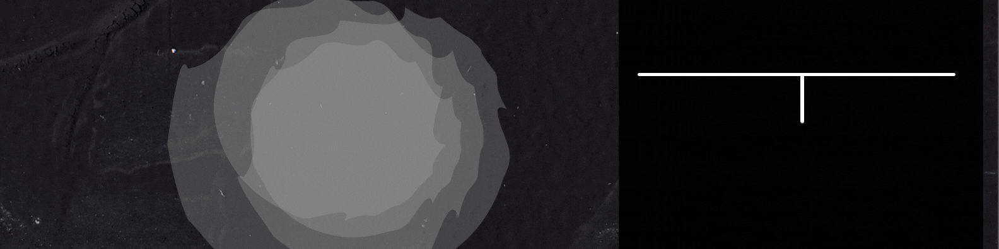
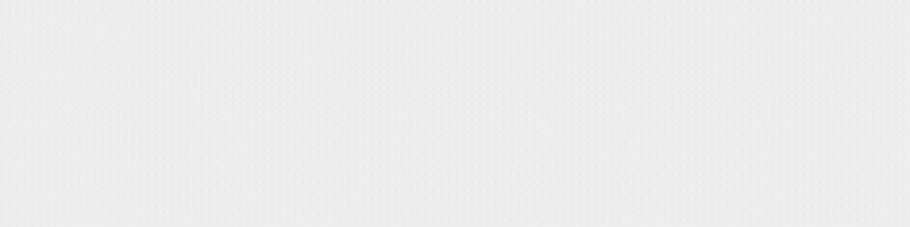

<!--Hello Welcome to my README.md-->
<!--Feel free to make this your own but dont use my data ;) -->

<h1 align="center">HeyI'm Devindu  </h1>

🌱 I’m currently learning HTML,CSS and JAVASCRIPT. 
👯 I’m looking to collaborate with other developers. 
🥅 2021 Goals: Be Productive and eat Healthy. 
⚡ Fun fact: I love to read.
  

<!--Github stats:START-->

&nbsp;

<!--Github stats:END-->

Last 5 Books I've Read

  
  <!-- GOODREADS-LIST:START -->
- [The Apprentice (Rizzoli & Isles, #2)](https://www.goodreads.com/review/show/4183711271?utm_medium=api&utm_source=rss) by Tess Gerritsen (⭐️4.12)
- [Digital Fortress](https://www.goodreads.com/review/show/4110472691?utm_medium=api&utm_source=rss) by Dan Brown (⭐️3.67)
<!-- GOODREADS-LIST:END -->

My favourite podcasts

  <!--PODCAST-LIST:START-->

  <a href = "https://open.spotify.com/show/1Y9ExMgMxoBVrgrfU7u0nD?si=XlRGAL5pSNiNiHiv4G8dvw&dl_branch=1">Safety Third</a>
    
 Safety Third is a weekly show hosted by William Osman, NileRed, The Backyard Scientist, Allen Pan, Peter Sripol, and a couple other YouTube "Scientists".

  <!--PODCAST-LIST:END-->

